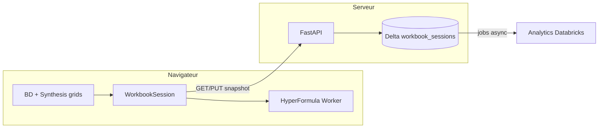

# Roadmap — Vehicle Mass Platform

État actuel (mai 2026) :

- **Database (BD)** : parité OK avec Excel (à re-vérifier ponctuellement).
- **Synthesis** : valeurs OK sur beaucoup de lignes, **colonnes A–J** ; ligne **25 ADAPTATION** = somme 26–40 (moteur session) ; reste (K+, couleurs) = UI en parallèle.
- **Front** : Vue 3, grilles virtualisées, navigation menu **keep-alive** (`v-show`, préchargement Syn en arrière-plan).
- **Édition** : saisie fluide (input non contrôlé pendant edit), validation numérique, persistance locale **patchs v2** (IndexedDB + localStorage).
- **Calcul** : `WorkbookSession` + SUMPRODUCT Syn ; HyperFormula BD dans **Web Worker** (chargement différé ~3 s).
- **Données** : `web/public/data/*.json` au boot ; **pas d’API Databricks** encore.
- **Entreprise** : Databricks seulement (pas MySQL/Supabase en prod).

### Déjà livré (récent)

| Zone | Statut |
|------|--------|
| Grilles BD/Syn affichage + edit | OK |
| Sauvegarde locale (même navigateur) | OK (patchs cellules) |
| Ligne 25 sommes C–J | OK |
| Menu burger Database ↔ Synthesis | Optimisé (grilles gardées en mémoire) |
| Auth Microsoft + hébergement | **À faire** (IT) |

### Prochaines étapes (ordre recommandé)

1. **IT** : Databricks Apps ou Azure Static Web + Entra ID (SSO).
2. **API** : `GET/PUT` session + table Delta (patchs, pas 12 Mo par save).
3. **Perf calcul** : invalidation par cellules (pas `revision` → toute la grille).
4. **Premier chargement** : snapshot compressé ou chargement par zone (réduire parse JSON).
5. **Golden tests** : `docs/golden-cells.md` (5–10 cellules témoin).

---

## Principes produit

| Principe | Détail |
|----------|--------|
| **Direct à l’écran** | Edit + recalcul dans le navigateur (mémoire + moteur). |
| **Sauvegarde** | Snapshot session vers Databricks : auto **60 s** + bouton **Enregistrer** — pas de SQL par frappe. |
| **Vérité métier** | `bdRaw` + `synRaw` (JSON structuré), pas re-export Excel obligatoire à chaque edit. |
| **Formules** | Export Excel → JSON en bootstrap ; ensuite moteur + session ; pas de saisie ligne par ligne dans le chat. |

---

## Vue d’ensemble (3 pistes parallèles)

```text
Piste A — Persistance Databricks     [semaines 1–3]
Piste B — Moteur de calcul           [semaines 1–4]
Piste C — Synthesis finition (A–J+)  [continu, non bloquant]
```



---

## Piste A — Base en ligne (Databricks)

### A0 — Prérequis IT (vous, ~1 jour)

- [ ] SQL Warehouse avec **auto-stop**
- [ ] Schéma Unity Catalog (ex. `main.vehicle_mass`)
- [ ] Droits **CREATE TABLE** + **INSERT/MERGE**
- [ ] Hébergement API Python (VM / Databricks Apps / autre)
- [ ] Lakebase : oui/non (optionnel, simplifie OLTP plus tard)

### A1 — Schéma Delta (dev, ~2 j)

Table **`workbook_sessions`** (v1) :

| Colonne | Type | Description |
|---------|------|-------------|
| `project_id` | STRING | PK logique (ex. `default` ou ID véhicule/projet) |
| `revision` | BIGINT | Incrément à chaque save (optimistic lock) |
| `bd_snapshot` | STRING ou VARIANT | JSON = `bdRaw` actuel |
| `syn_snapshot` | STRING ou VARIANT | JSON = `synRaw` actuel |
| `updated_at` | TIMESTAMP | |
| `updated_by` | STRING | User AD / email |

Option v2 : table `cell_changes` (audit) — pas en v1.

### A2 — API Python FastAPI (dev, ~1 semaine)

| Endpoint | Rôle |
|----------|------|
| `GET /api/v1/sessions/{project_id}` | Charge BD + Syn |
| `PUT /api/v1/sessions/{project_id}` | Body : `{ revision, bd, syn }` — remplace snapshots |
| `GET /api/v1/health` | Santé |

Auth : selon standards IT (token, réseau interne).

Dossier cible : `api/` (Python, pas Laravel).

### A3 — Branchement front (dev, ~3–5 j)

- [x] Persistance locale patchs (`sessionPersistence.js` v2) en attendant l’API
- [ ] `loadBd()` / `loadSynthesis()` : API si dispo, sinon fallback `public/data/*.json`
- [ ] Après chaque edit : marquer session dirty (déjà `dirty` dans `main.js`)
- [ ] **Enregistrer** + timer **60 s** → `PUT` snapshot complet
- [ ] Indicateurs : `Enregistré` / `Enregistrement…` / `Conflit de revision`
- [ ] Au load : appliquer `transformBdSheet` / `transformSynthesisSheet` comme aujourd’hui

Fichiers : `web/js/main.js`, nouveau `web/js/sessionApi.js`.

### A4 — Ops & passation (vous + dev, ~2 j)

- [ ] README : créer table, lancer API, variables d’env
- [ ] Job Databricks optionnel : copie snapshot → tables analytiques (plus tard)

**Jalon A** : deux navigateurs ou F5 retrouvent les mêmes valeurs après save.

---

## Piste B — Moteur de calcul

### B0 — Golden tests (vous + dev, ~2 j)

Cellules témoin (noter Excel vs app après edit) :

| # | Action | Cellule à vérifier |
|---|--------|-------------------|
| 1 | Edit masse BD | 1 cellule Synthesis SUMPRODUCT (col > J) |
| 2 | Edit filtre Syn | Bande filtres + 1 métrique |
| 3 | Formule BD simple | Cellule avec `f` dans JSON |
| 4 | Formule plage lourde | Si présente (ex. ref `BD!O2:O3480`) |
| 5 | Matrix save | Structure + recalcul |

Fichier suggéré : `docs/golden-cells.md` (à remplir).

### B1 — Bench & go/no-go (dev, ~3 j)

- Mesurer p50/p95 après edit sur golden cells
- Cible : **< 100 ms** perçu (edit simple)
- Lister fonctions Excel non supportées par HyperFormula

### B2 — Web Worker (dev, ~1 semaine)

- [x] Déplacer `WorkbookEngine` / HyperFormula dans un **Worker**
- [x] API message : `load`, `setCell`, `destroy` + cache valeurs côté main
- [ ] UI reste réactive pendant recalcul lourd (à valider sur machine métier)

Fichiers : `workbookEngine.worker.js`, `workbookEngineClient.js`, `workbookEngineCore.js`.

### B3 — Synthesis dans le moteur (dev, ~1–2 semaines)

- [ ] Étendre au-delà de `computeSumproduct` seul si nécessaire
- [ ] Ou documenter colonnes K+ = HF vs SUMPRODUCT dédié
- [ ] `bindSynthesisGrid` + invalidation cache cohérents après save/load API

### B4 — Perf affichage (dev, ~1 semaine)

- [x] Navigation menu : grilles BD/Syn **gardées montées** (`v-show` + preload Syn)
- [ ] Re-render **dirty cells** seulement (pas `revision` → toute la grille)
- [ ] Vérifier scroll 60 fps BD + Syn

**Jalon B** : edit BD met à jour Synthesis sur golden set sans freeze UI.

---

## Piste C — Synthesis (vous, en parallèle)

Priorité après A–J valeurs OK :

1. Colonnes **K+** (valeurs puis styles véhicules / projets)
2. Couleurs bandeaux (filtres, métriques, headers)
3. Blocs par zone (pas tout le sheet d’un coup)

**Non bloquant** pour A1–A3 et B2 si les saves portent déjà `synRaw` complet.

---

## Planning suggéré (8 semaines)

| Semaine | Piste A (BDD) | Piste B (moteur) | Piste C (vous) |
|---------|---------------|------------------|----------------|
| **1** | A0 IT + A1 schéma Delta | B0 golden + B1 bench | Syn K+ valeurs (échantillon) |
| **2** | A2 API FastAPI | B2 Worker (début) | Syn couleurs bloc filtres |
| **3** | A3 front save/load | B2 Worker (fin) | Syn colonnes véhicules |
| **4** | A4 doc + tests multi-user | B3 Synthesis calcul | Syn reste styles |
| **5–6** | Job analytique optionnel | B4 dirty render | C finition |
| **7–8** | Autres pages → même session | Stabilisation | — |

---

## Ce que **vous** faites vs **dev / Agent**

| Vous | Dev / Cursor Agent |
|------|---------------------|
| Validation IT Databricks | Schéma SQL + notebooks création table |
| Remplir `docs/golden-cells.md` (5–10 cas) | Worker + bench |
| Synthesis styles / colonnes K+ | API FastAPI + `sessionApi.js` |
| Tests métier après chaque jalon | Fix recalcul / remap si golden échoue |
| Ne pas lister 3000 formules | Lire formules depuis `bdRaw`/`synRaw` |

---

## Hors scope immédiat

- Laravel (`api/README.md` obsolète pour prod — remplacer par Python)
- SQL à chaque touche
- Parité pixel-perfect Synthesis 100 % avant premier save Databricks
- Pages CDC, Portfolio, Waterline (EmptyPage) — après jalons A + B

---

## Jalons « go » équipe

| Jalon | Critère |
|-------|---------|
| **MVP save** | Edit BD/Syn → Enregistrer → F5 → valeurs identiques |
| **MVP calcul** | 5 golden cells recalcul OK, Worker actif |
| **V1** | Auto-save 60 s stable 1 semaine + doc IT |

---

## Prochaine action (cette semaine)

1. **Vous** : envoyer ticket IT (template section A0).
2. **Vous** : créer `docs/golden-cells.md` avec 5 lignes (edit BD → Syn).
3. **Dev** : démarrer **A1 + A2** (Delta + FastAPI) en parallèle de **B2** (Worker).
4. **Vous** : Synthesis colonnes **K+** quand pas sur calls IT.

Ordre technique recommandé si **une seule** ressource dev : **A2 API mock local** → **A3 front** → **B2 Worker** → **B3 Syn calcul**.
